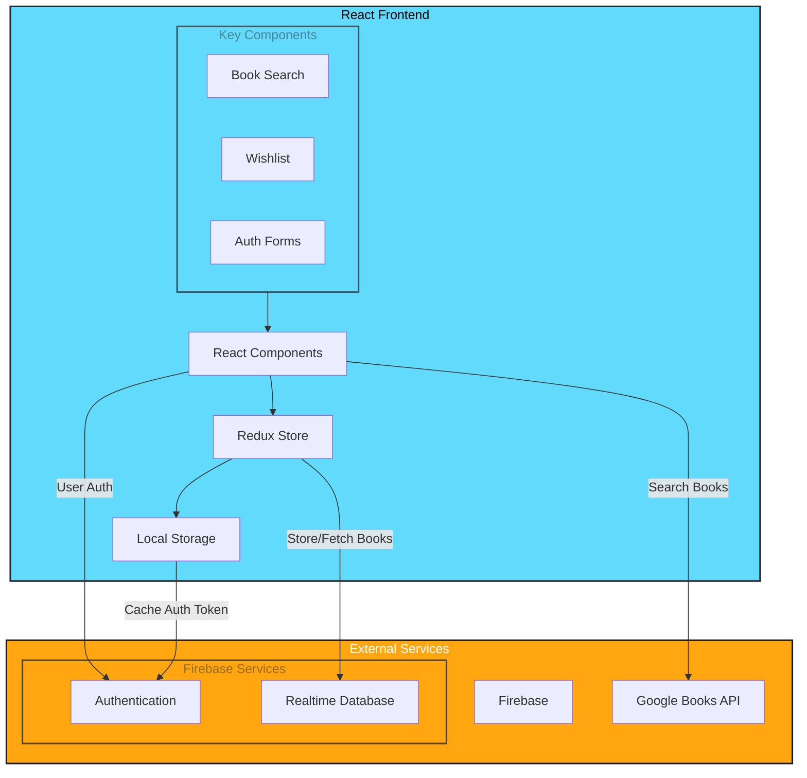

# 📚 BookShelf: Personal Book Tracking App

## 📑 Table of Contents
- [Live Demo](#-live-demo)
- [Overview](#-overview)
- [Features](#-features)
- [Tech Stack](#️-tech-stack)
- [Architecture](#️-architecture)
- [Key Features](#-key-features)
 - [User Authentication](#user-authentication)
 - [Book Management](#book-management)
 - [Data Persistence](#data-persistence)
- [Screenshots](#-screenshots)
- [Installation](#️-installation)
- [Technical Implementation](#-technical-implementation)
- [Deployment](#-deployment)
- [Contributing](#-contributing)
- [License](#-license)

## 🔗 Live Demo
[Visit BookShelf](https://the-book-shelf2.vercel.app/)

## 🎯 Overview
BookShelf is a modern web application that helps users maintain their personal book wishlist and track reading progress. Built with React and Firebase, it offers a seamless experience for book discovery and tracking.

## ✨ Features
- Book search via Google Books API
- Personal reading wishlist
- Reading progress tracking
- Secure user authentication
- Responsive mobile design
- Real-time data synchronization

## 🛠️ Tech Stack
-  - Frontend Framework
-  - State Management
-  - Backend & Authentication
-  - UI Framework
-  - Deployment

## 🏗️ Architecture

## 💡 Key Features

### User Authentication
- Secure sign-up and login
- JWT token management
- Protected routes
- Persistent sessions

### Book Management
- Search books via Google Books API
- Add books to personal wishlist
- Track reading status
- Real-time updates

### Data Persistence
- Firebase Realtime Database
- Local storage for session management
- Cached responses for better performance

## 📱 Screenshots

### Search Interface

### Book List View

### Authentication

## ⚙️ Installation

### Prerequisites
- Node.js
- npm
- Firebase account

### Local Setup
1. Clone the repository
2. Install dependencies: `npm install`
3. Start development server: `npm start`
4. Visit `http://localhost:3000`

## 🌟 Technical Implementation

### React Features Used
- Functional Components
- React Hooks
- Context API
- Protected Routes
- Custom Hooks

### State Management
- Redux for global state
- Local state with useState
- Context for theme/auth
- Persistent storage integration

### API Integration
- Google Books API for search
- Firebase REST API for data
- JWT authentication flow
- Error handling

## 🚀 Deployment
- Automated deployment via Vercel
- GitHub integration for CI/CD
- Production optimizations
- Performance monitoring

## 🤝 Contributing
Contributions welcome! Feel free to:
- Fork the repository
- Create feature branch
- Submit pull requests

## 📜 License
[MIT](LICENSE)
